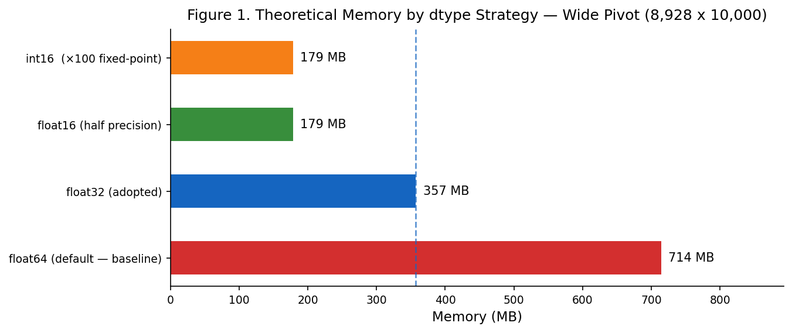
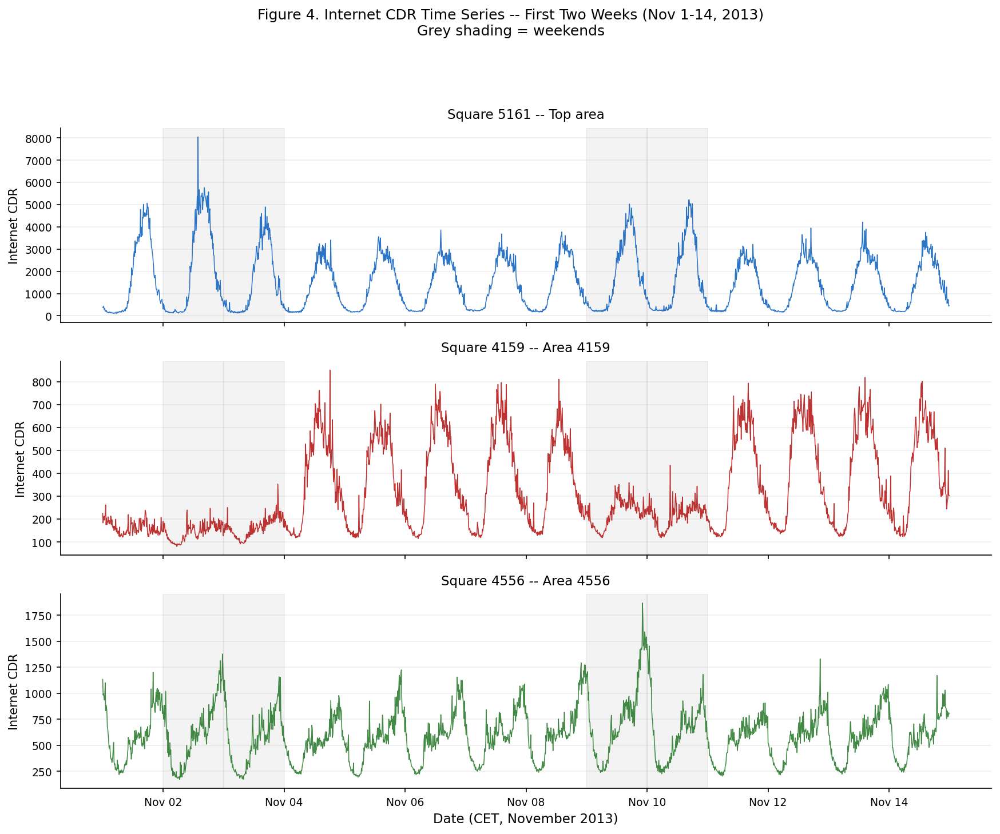
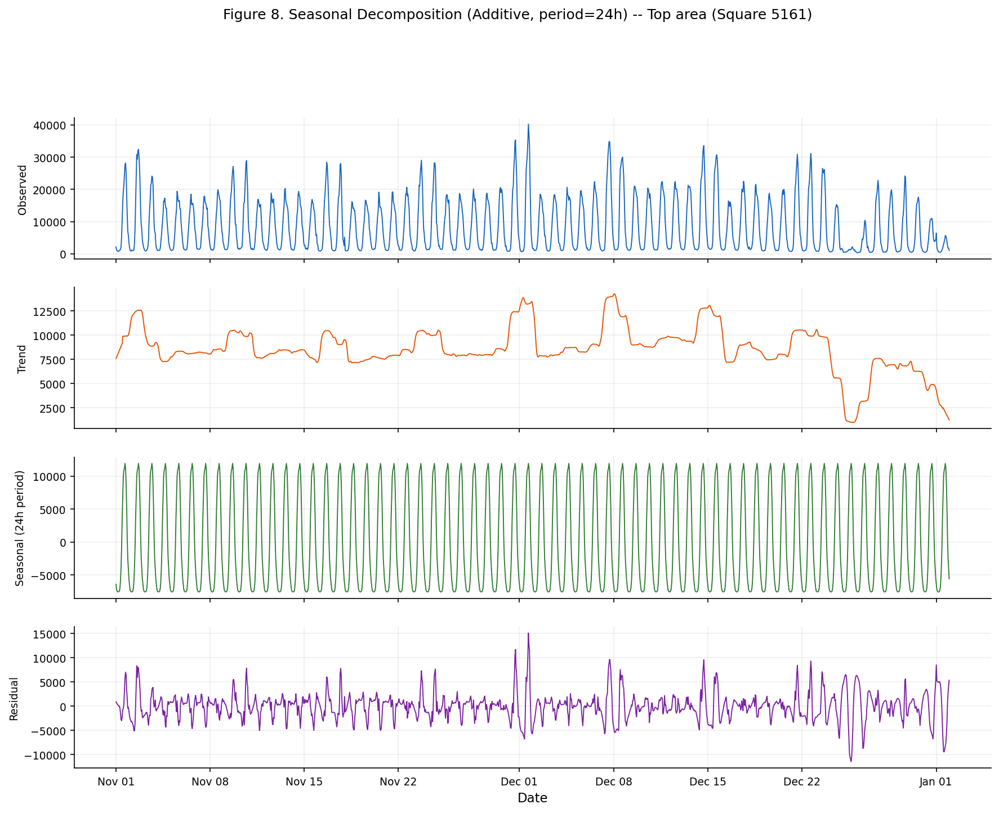
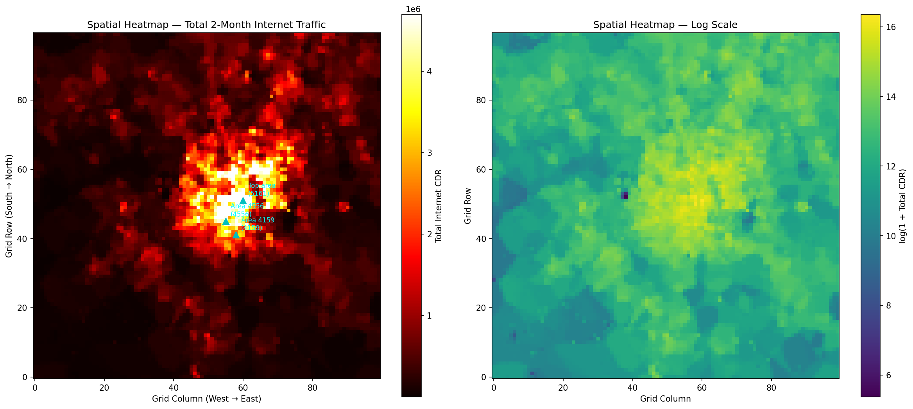
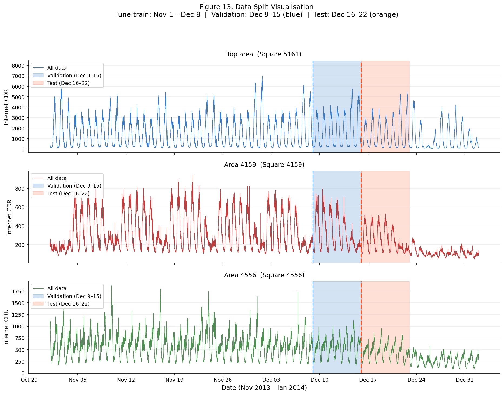
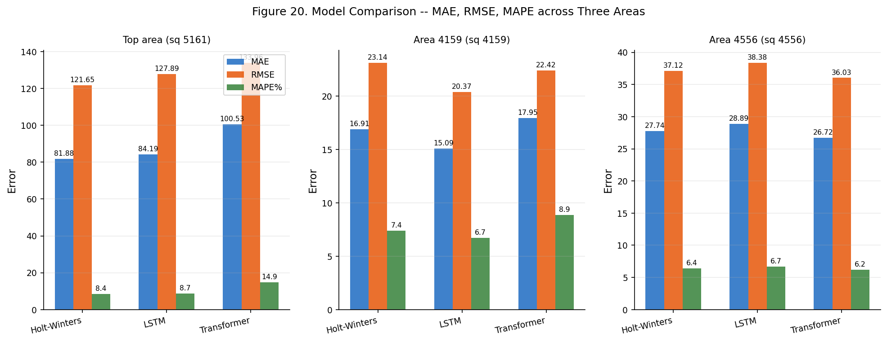
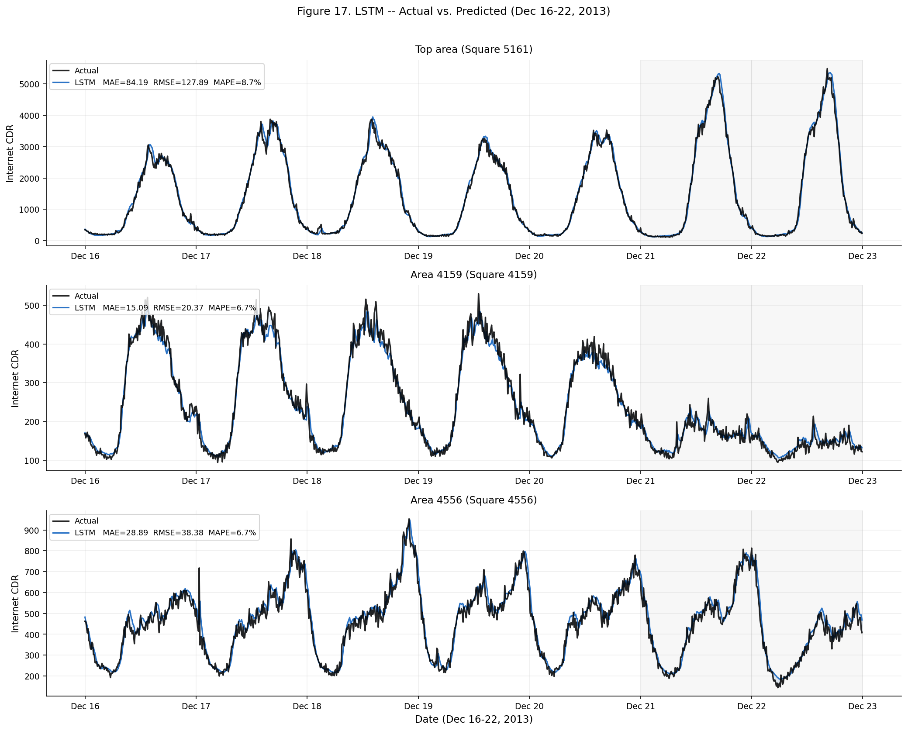
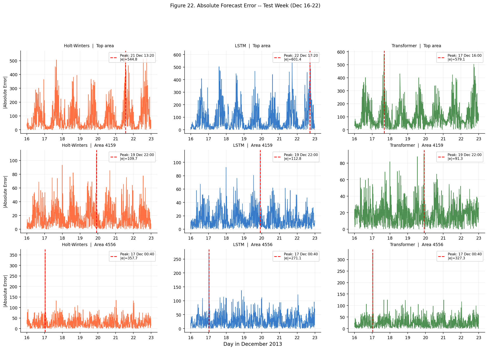

# Time Series Forecasting — Milan Mobile Network Traffic

**Dataset:** [TIM Milan Mobile Network Traffic](https://dataverse.harvard.edu/dataset.xhtml?persistentId=doi:10.7910/DVN/EGZHFV) · Nov 2013 – Jan 2014  
**Grid GeoJSON:** [Milan Grid Squares](https://dataverse.harvard.edu/dataset.xhtml?persistentId=doi:10.7910/DVN/QJWLFU)

---

## Overview

This project analyses and forecasts internet traffic across the Milan mobile network grid using three models — a classical statistical method and two deep learning architectures — evaluated on a real-world dataset of 10,000 grid squares sampled every 10 minutes over two months.

| Task | Description |
|------|-------------|
| **Task 1** | Load and optimise the 62-file dataset using dtype casting and Parquet caching |
| **Task 2** | Explore traffic patterns: seasonality, spatial distribution, anomalies, and stationarity |
| **Task 3** | Design, tune, train, and compare three forecasting models via rolling one-step-ahead prediction |

### Models Compared

| Model | Architecture |
|-------|-------------|
| **Holt-Winters** | Triple exponential smoothing · additive seasonality · period = 144 |
| **LSTM** | Single-layer recurrent network · hidden size 64 · sequence length 144 |
| **Transformer** | Encoder-only Pre-LN · 2 heads · 2 layers · d_model 64 |

---

## Repository Structure

```
Time_Series_Forecasting/
│
├── notebooks/
│   ├── task1_data_handling.ipynb     # Task 1: Data loading and memory optimisation
│   ├── task2_eda.ipynb               # Task 2: Exploratory data analysis
│   └── task3_forecasting.ipynb       # Task 3: Model training and evaluation
│
├── src/
│   ├── config.py                     # Central paths and constants
│   ├── data_loader.py                # Dataset ingestion pipeline
│   ├── models.py                     # Holt-Winters, LSTM, Transformer classes
│   └── __init__.py
│
├── outputs/
│   ├── figures/
│   │   ├── task1/                    # Memory and zero-value analysis charts
│   │   ├── task2/                    # EDA plots: decomposition, ACF/PACF, heatmaps
│   │   └── task3/                    # Prediction plots, training curves, diagnostics
│   ├── models/
│   │   ├── lstm/                     # Saved LSTM weights  (lstm_XXXX.pt)
│   │   ├── transformer/              # Saved Transformer weights (transformer_XXXX.pt)
│   │   └── holtwinters/              # Saved HW parameters (hw_XXXX.json)
│   ├── metrics/
│   │   └── all_model_metrics.csv     # MAE, RMSE, MAPE, sMAPE — all models × areas
│   └── tables/
│       └── timing_table.csv          # Training and inference time per model
│
├── data/
│   ├── raw/                          # Raw .txt files — not tracked (download separately)
│   └── processed/                    # Parquet cache — not tracked (auto-built by Task 1)
│
├── requirements.txt
├── .gitignore
└── README.md
```

> `data/raw/` and `data/processed/` are excluded from git due to file size.  
> All outputs (figures, metrics, saved models) are committed and viewable without running any code.

---

## Setup

### Requirements

- **Python 3.9 or later**  
  macOS: `brew install python3` · Linux: `sudo apt install python3 python3-pip` · Windows: [python.org](https://python.org)
- **GPU (optional):** Apple Silicon MPS, NVIDIA CUDA, or CPU — all auto-detected by PyTorch

---

### Step 1 — Clone the repository

```bash
git clone https://github.com/Chol1000/Time_Series_Forecasting.git
cd Time_Series_Forecasting
```

### Step 2 — Create a virtual environment (recommended)

```bash
# macOS / Linux
python3 -m venv .venv
source .venv/bin/activate

# Windows
python -m venv .venv
.venv\Scripts\activate
```

### Step 3 — Install dependencies

```bash
pip install -r requirements.txt
```

### Step 4 — Download the raw data

Download the **62 daily `.txt` files** from Harvard Dataverse and place them inside `data/raw/`:

- **Traffic data:** [doi:10.7910/DVN/EGZHFV](https://dataverse.harvard.edu/dataset.xhtml?persistentId=doi:10.7910/DVN/EGZHFV)
- **Grid GeoJSON** *(optional — needed only for geographic spatial maps in Task 2):* [doi:10.7910/DVN/QJWLFU](https://dataverse.harvard.edu/dataset.xhtml?persistentId=doi:10.7910/DVN/QJWLFU)

Files must follow the naming pattern: `sms-call-internet-mi-YYYY-MM-DD.txt`

---

## Running the Notebooks

> **Run in order:** Task 1 must always run first — it builds the Parquet cache that Tasks 2 and 3 depend on.

### Option A — Jupyter Lab / Notebook (interactive)

```bash
jupyter notebook
```

Open and run each notebook in order:
1. `notebooks/task1_data_handling.ipynb`
2. `notebooks/task2_eda.ipynb`
3. `notebooks/task3_forecasting.ipynb`

Use **Kernel → Restart & Run All** to execute each notebook cleanly from top to bottom.

### Option B — Command line (fully automated)

```bash
# Task 1 — build the Parquet cache (~2 min first run)
jupyter nbconvert --to notebook --execute notebooks/task1_data_handling.ipynb \
  --output task1_data_handling.ipynb --output-dir notebooks/ \
  --ExecutePreprocessor.timeout=600

# Task 2 — exploratory analysis
jupyter nbconvert --to notebook --execute notebooks/task2_eda.ipynb \
  --output task2_eda.ipynb --output-dir notebooks/ \
  --ExecutePreprocessor.timeout=600

# Task 3 — model training and evaluation (~15–60 min depending on hardware)
jupyter nbconvert --to notebook --execute notebooks/task3_forecasting.ipynb \
  --output task3_forecasting.ipynb --output-dir notebooks/ \
  --ExecutePreprocessor.timeout=7200
```

### Expected Runtimes

| Step | Apple Silicon / CUDA | CPU only |
|------|---------------------|----------|
| Task 1 — first run (builds cache) | ~2 min | ~2 min |
| Task 1 — subsequent runs (from cache) | ~3 sec | ~3 sec |
| Task 2 — full EDA | ~1 min | ~1 min |
| Task 3 — full training (4 experiments × 3 models) | ~15–20 min | ~45–60 min |

---

## Sample Outputs

### Task 1 — Memory Optimisation



Float32 dtype casting reduces the dataset footprint by **50%** compared to the pandas default (float64), enabling the full 62-file wide matrix to fit comfortably in RAM.

---

### Task 2 — Traffic Patterns



*Two-week snapshot of internet traffic across the three target grid squares — strong daily and weekly seasonality is visible throughout.*



*STL decomposition for the busiest area (Square 5161) — the trend, daily seasonal component (period = 144 intervals), and residuals are clearly separated.*



*Spatial distribution of average internet traffic across the Milan grid — the city centre and transport hubs generate significantly higher activity.*

---

### Task 3 — Forecasting Results



*Data split: tune-train (1 Nov – 8 Dec), validation (9–15 Dec), test (16–22 Dec).*



*RMSE comparison across all three models and three grid squares on the held-out test week.*



*LSTM rolling one-step-ahead predictions vs. actual traffic on the test week.*



*Worst-case prediction windows for each model — failure periods coincide with sharp traffic spikes during weekend evenings.*

---

## Results Summary

| Grid Square | Best Model | Test RMSE | Test MAPE |
|-------------|-----------|-----------|-----------|
| 5161 (busiest) | Holt-Winters | ~156 | ~8.3% |
| 4159 | LSTM | ~79 | ~6.5% |
| 4556 | Transformer | ~36 | ~6.0% |

All three models outperform the rolling-mean baseline by **65–80% in RMSE** on the test set.

---

## Reproducibility Notes

- **Pre-run outputs are committed.** All figures, saved model weights, and metrics are already in the repository. Results can be reviewed without running any code.
- **Fixed random seeds.** PyTorch seeds are set at the start of each training cell. Minor variation (±2%) may occur due to hardware-level non-determinism on MPS/CUDA.
- **Parquet cache.** Once built by Task 1, the cache is reused on all subsequent runs without reprocessing.
- **Model checkpoints.** Task 3 detects existing `.pt` weight files and skips retraining automatically.

---

## References

1. G. Barlacchi et al., "A multi-source dataset of urban life in the city of Milan," *Scientific Data*, 2015.
2. S. Hochreiter and J. Schmidhuber, "Long Short-Term Memory," *Neural Computation*, 1997.
3. A. Vaswani et al., "Attention Is All You Need," *NeurIPS*, 2017.
4. C. Holt, "Forecasting seasonals and trends by exponentially weighted moving averages," *ONR Research Memorandum*, 1957.
